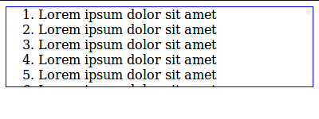

# scroll-buttons

[![Commitizen friendly][commitizen-image]][commitizen-url]

[![NPM version][npm-image]][npm-url]
[![Build Status][travis-image]][travis-url]
[![Dependency Status][depstat-image]][depstat-url]
[![DevDependency Status][depstat-dev-image]][depstat-dev-url]

> Scrolls list on buttons hover ([demo][demo-url])

## Install

```shell
npm install --save scroll-buttons
```

## Usage

```javascript
var ScrollButtons = require('scroll-buttons');

var scrollButtons = new ScrollButtons({
    $scroll: $('.js-list__scroll'),
    $buttons: $('.js-scroll-buttons__button'),
});
```



## Development

### Initialize
```shell
npm i
```

### Test
*In terminal*
```shell
npm run test
```

*In browser*
```shell
open ./text/index-test.html
```

### Lint
```shell
npm run lint
```

## License
MIT © [Vladimir Rodkin](https://github.com/VovanR)

[demo-url]: https://jsfiddle.net/VovanR/7m4838yz/

[commitizen-url]: http://commitizen.github.io/cz-cli/
[commitizen-image]: https://img.shields.io/badge/commitizen-friendly-brightgreen.svg?style=flat-square

[npm-url]: https://npmjs.org/package/scroll-buttons
[npm-image]: http://img.shields.io/npm/v/scroll-buttons.svg?style=flat-square

[travis-url]: https://travis-ci.org/VovanR/scroll-buttons
[travis-image]: http://img.shields.io/travis/VovanR/scroll-buttons.svg

[depstat-url]: https://david-dm.org/VovanR/scroll-buttons
[depstat-image]: https://david-dm.org/VovanR/scroll-buttons.svg

[depstat-dev-url]: https://david-dm.org/VovanR/scroll-buttons
[depstat-dev-image]: https://david-dm.org/VovanR/scroll-buttons/dev-status.svg
